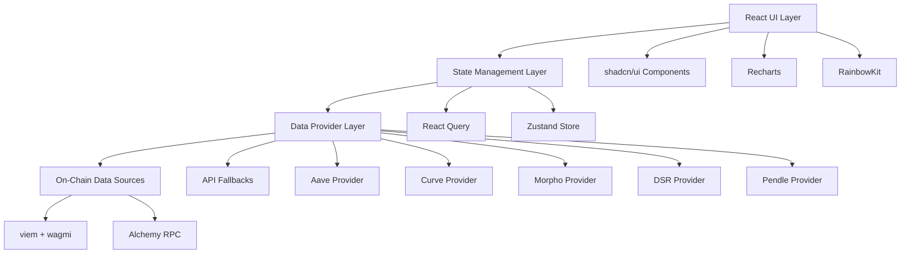
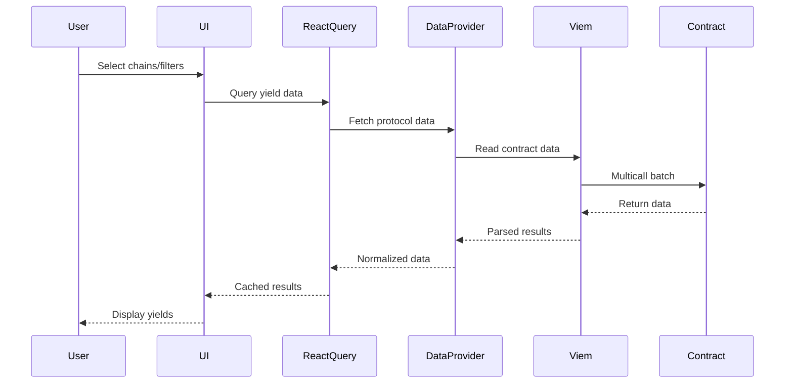

# Design Document

## Overview

The Stablecoin Yield Monitor is architected as a modern React application with a focus on real-time DeFi data aggregation, yield calculations, and user experience. The system follows a modular, provider-based architecture that abstracts protocol-specific implementations behind consistent interfaces, enabling easy extension and maintenance.

The application uses a hybrid data fetching strategy combining on-chain reads via viem with fallback API endpoints, ensuring reliability while maintaining decentralization principles. State management is handled through React Query for server state and Zustand for UI preferences, providing optimal caching and synchronization.

## Architecture

### High-Level Architecture



### Data Flow Architecture



## Components and Interfaces

### Core Data Types

```typescript
// Core domain types
interface StablecoinYield {
  protocol: Protocol;
  chain: Chain;
  asset: StablecoinAsset;
  supplyAPY: number;
  borrowAPY: number;
  utilization: number;
  totalSupply: bigint;
  totalBorrow: bigint;
  supplyCap: bigint;
  borrowCap: bigint;
  ltv: number;
  liquidationThreshold: number;
  reserveFactor: number;
  eModeCategory?: number;
  lastUpdated: Date;
}

interface CurvePoolData {
  poolAddress: string;
  name: string;
  chain: Chain;
  baseAPY: number;
  boostedAPY: number;
  tvl: bigint;
  pegDeviation: number;
  assets: StablecoinAsset[];
  lastUpdated: Date;
}

interface LoopCalculation {
  principal: bigint;
  totalSupplied: bigint;
  totalBorrowed: bigint;
  currentLTV: number;
  netAPY: number;
  annualProfit: bigint;
  healthFactor: number;
  liquidationPrice: number;
}

interface AlertRule {
  id: string;
  type: 'spread' | 'boosted_apy' | 'dsr_change';
  threshold: number;
  chain?: Chain;
  protocol?: Protocol;
  asset?: StablecoinAsset;
  isActive: boolean;
}
```

### Data Provider Interface

```typescript
interface DataProvider<T> {
  fetchData(chains: Chain[], assets: StablecoinAsset[]): Promise<T[]>;
  isSupported(chain: Chain): boolean;
  getUpdateInterval(): number;
}

interface AaveDataProvider extends DataProvider<StablecoinYield> {
  getReserveData(chain: Chain, asset: StablecoinAsset): Promise<StablecoinYield>;
  getEModeCategories(chain: Chain): Promise<EModeCategory[]>;
}

interface CurveDataProvider extends DataProvider<CurvePoolData> {
  getPoolData(chain: Chain, poolAddress: string): Promise<CurvePoolData>;
  getTopStablePools(chain: Chain): Promise<CurvePoolData[]>;
}
```

### Component Architecture

```typescript
// Page Components
- Dashboard: Main yield monitoring interface
- LoopCalculator: Leveraged yield calculation tool
- Alerts: Alert management interface
- ReserveDetails: Detailed protocol information

// Feature Components
- YieldTable: Sortable yield data display
- LoopMonitorTable: Spread analysis table
- ChainSelector: Multi-select chain filter
- StablecoinFilter: Asset filtering
- CalculatorForm: Loop parameter inputs
- AlertsManager: Alert rule configuration

// UI Components (shadcn/ui based)
- DataCard: Metric display cards
- YieldChart: Recharts integration
- HealthBadge: Risk indicator
- ConnectWallet: RainbowKit integration
```

## Data Models

### Chain Configuration

```typescript
// chains.ts
export const SUPPORTED_CHAINS = {
  ethereum: {
    ...mainnet,
    rpcUrls: {
      alchemy: `https://eth-mainnet.g.alchemy.com/v2/${process.env.VITE_ALCHEMY_API_KEY}`,
    },
    multicallAddress: '0xcA11bde05977b3631167028862bE2a173976CA11',
    contracts: {
      aavePoolDataProvider: '0x7B4EB56E7CD4b454BA8ff71E4518426369a138a3',
      aaveUiPoolDataProvider: '0x91c0eA31b49B69Ea18607702c5d9aC360bf3dE7d',
    }
  },
  // ... other chains
} as const;
```

### Protocol Contracts

```typescript
// Contract ABIs and addresses
export const AAVE_CONTRACTS = {
  UiPoolDataProviderV3: {
    abi: [...], // Full ABI with proper typing
    addresses: {
      [mainnet.id]: '0x91c0eA31b49B69Ea18607702c5d9aC360bf3dE7d',
      [arbitrum.id]: '0x145dE30c929a065582da84Cf96F88460dB9745A7',
      // ... other chains
    }
  }
} as const;
```

### State Management Schema

```typescript
// Zustand store for UI preferences
interface UIStore {
  selectedChains: Chain[];
  selectedAssets: StablecoinAsset[];
  darkMode: boolean;
  alertsEnabled: boolean;
  calculatorParams: LoopCalculatorParams;
  
  setSelectedChains: (chains: Chain[]) => void;
  toggleDarkMode: () => void;
  updateCalculatorParams: (params: Partial<LoopCalculatorParams>) => void;
}

// React Query keys and configuration
export const queryKeys = {
  aaveYields: (chains: Chain[], assets: StablecoinAsset[]) => 
    ['aave', 'yields', chains, assets] as const,
  curveData: (chains: Chain[]) => 
    ['curve', 'pools', chains] as const,
  dsrRate: () => ['dsr', 'rate'] as const,
} as const;
```

## Error Handling

### Error Boundary Strategy

```typescript
// Global error boundary for unhandled errors
class GlobalErrorBoundary extends Component {
  // Catches and logs all React errors
  // Displays fallback UI with retry options
  // Integrates with error reporting service
}

// Feature-specific error boundaries
- DataProviderErrorBoundary: Handles data fetching errors
- CalculatorErrorBoundary: Handles calculation errors
- ChartErrorBoundary: Handles chart rendering errors
```

### Error Recovery Patterns

```typescript
// Graceful degradation for data providers
interface DataProviderWithFallback<T> {
  primary: DataProvider<T>;
  fallback?: DataProvider<T>;
  
  async fetchWithFallback(): Promise<T[]> {
    try {
      return await this.primary.fetchData();
    } catch (error) {
      if (this.fallback) {
        console.warn('Primary provider failed, using fallback:', error);
        return await this.fallback.fetchData();
      }
      throw error;
    }
  }
}
```

### Network Error Handling

```typescript
// Retry logic for network requests
const retryConfig = {
  attempts: 3,
  delay: 1000,
  backoff: 'exponential',
  retryCondition: (error) => {
    return error.code === 'NETWORK_ERROR' || 
           error.code === 'TIMEOUT' ||
           error.status >= 500;
  }
};

// Circuit breaker for failing providers
class CircuitBreaker {
  private failures = 0;
  private lastFailure?: Date;
  private readonly threshold = 5;
  private readonly timeout = 60000; // 1 minute
  
  async execute<T>(fn: () => Promise<T>): Promise<T> {
    if (this.isOpen()) {
      throw new Error('Circuit breaker is open');
    }
    
    try {
      const result = await fn();
      this.onSuccess();
      return result;
    } catch (error) {
      this.onFailure();
      throw error;
    }
  }
}
```

## Testing Strategy

### Unit Testing Approach

```typescript
// Core calculation functions testing
describe('Loop Calculator', () => {
  test('calculates multi-loop APY correctly', () => {
    const params = {
      principal: 10000n,
      supplyAPY: 0.05,
      borrowAPY: 0.03,
      ltv: 0.8,
      loops: 3
    };
    
    const result = calculateLoopAPY(params);
    expect(result.netAPY).toBeCloseTo(0.087, 3);
  });
  
  test('handles negative spread scenarios', () => {
    const params = {
      supplyAPY: 0.02,
      borrowAPY: 0.04, // Higher than supply
      ltv: 0.8
    };
    
    const result = calculateLoopAPY(params);
    expect(result.netAPY).toBeLessThan(0);
    expect(result.warnings).toContain('NEGATIVE_SPREAD');
  });
});

// Data provider testing with mocks
describe('Aave Data Provider', () => {
  test('fetches reserve data correctly', async () => {
    const mockContract = vi.fn().mockResolvedValue([
      /* mock reserve data */
    ]);
    
    const provider = new AaveDataProvider(mockContract);
    const data = await provider.getReserveData(mainnet, 'USDC');
    
    expect(data.supplyAPY).toBeGreaterThan(0);
    expect(data.borrowAPY).toBeGreaterThan(0);
  });
});
```

### Integration Testing

```typescript
// End-to-end user flows
describe('Dashboard Integration', () => {
  test('displays yield data after chain selection', async () => {
    render(<Dashboard />);
    
    // Select Ethereum mainnet
    await user.click(screen.getByText('Ethereum'));
    
    // Wait for data to load
    await waitFor(() => {
      expect(screen.getByText(/Supply APY/)).toBeInTheDocument();
    });
    
    // Verify yield data is displayed
    expect(screen.getByTestId('aave-usdc-supply-apy')).toHaveTextContent(/\d+\.\d+%/);
  });
});
```

### Performance Testing

```typescript
// React Query cache performance
describe('Data Caching', () => {
  test('avoids redundant network calls', async () => {
    const fetchSpy = vi.spyOn(aaveProvider, 'fetchData');
    
    // First render
    const { rerender } = render(<YieldTable />);
    await waitFor(() => expect(fetchSpy).toHaveBeenCalledTimes(1));
    
    // Re-render with same props
    rerender(<YieldTable />);
    
    // Should use cached data
    expect(fetchSpy).toHaveBeenCalledTimes(1);
  });
});
```

## Implementation Phases

### Phase 1: Core Infrastructure
- Project setup with Vite, TypeScript, and tooling
- Chain configuration and viem setup
- Basic UI components and routing
- Wallet connection with RainbowKit

### Phase 2: Data Layer
- Aave data provider implementation
- Contract integration with proper typing
- React Query setup and caching
- Error handling and fallbacks

### Phase 3: Dashboard Features
- Yield monitoring dashboard
- Chain and asset filtering
- Basic yield calculations
- Responsive UI implementation

### Phase 4: Advanced Features
- Loop calculator with multi-loop support
- Curve/Convex integration
- DSR and Pendle data providers
- Alert system implementation

### Phase 5: Polish and Optimization
- Performance optimization
- Comprehensive testing
- Error boundary implementation
- Documentation and deployment

## Security Considerations

### Data Validation
- All on-chain data validated against expected ranges
- Input sanitization for user-provided parameters
- Rate limiting for API calls to prevent abuse

### Contract Interaction Safety
- Read-only operations with no transaction signing
- Proper error handling for contract call failures
- Validation of contract addresses and ABIs

### Environment Security
- API keys stored in environment variables
- No sensitive data in client-side code
- Proper CORS configuration for API endpoints

This design provides a robust foundation for the Stablecoin Yield Monitor, emphasizing modularity, reliability, and user experience while maintaining the flexibility to extend with additional protocols and features.