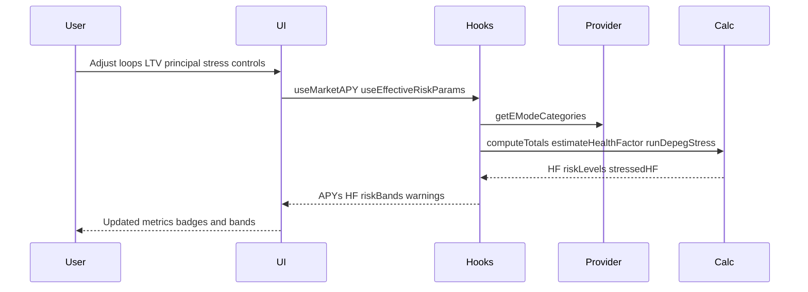

# Task 10: Health factor and risk assessment - Implementation Plan

Scope
- Add health factor calculation and display in Loop Calculator
- Create depeg stress controls with real-time updates and risk bands visualization
- Display negative spread warnings and risk badges with color coding

Requirements mapping
- Req 3.3: Display health factor using E-Mode LT and LTV estimation
- Req 3.5: Depeg stress sliders show updated health factor and liquidation risk bands
- Req 3.6: Negative spread warning when borrow APY exceeds supply APY
- Req 9.5: Health factor estimated using E-Mode LT and parameters

Current state summary
- Loop APY and spread computed by [calculateLoopAPY()](src/lib/calculations.ts:40) and [calculateNetSpread()](src/lib/calculations.ts:25)
- Health factor and stress primitives exist: [estimateHealthFactor()](src/lib/calculations.ts:87), [runDepegStress()](src/lib/calculations.ts:106)
- Totals and leverage helpers exist: [computeTotals()](src/lib/leverage.ts:93), [leverageFromLTVPercent()](src/lib/leverage.ts:28)
- Loop Calculator UI present with spread warning: [LoopCalculator](src/components/LoopCalculator.tsx:55), [useLoopCalculation()](src/hooks/useCalculator.ts:46), [useNetSpread()](src/hooks/useCalculator.ts:24)
- Aave yields include LTV and LT per reserve via provider: [AaveV3DataProvider](src/lib/providers/aave.ts:585)

Design decisions
- Use stablecoin E-Mode defaults when both assets are stable on the same chain: LTV 93, LT 95
- Otherwise use the deposit asset base LTV and LT returned by Aave provider
- Health factor thresholds and colors
  - critical: HF < 1.0, red
  - high: 1.0 ≤ HF < 1.1, red 600 text on light
  - medium: 1.1 ≤ HF < 1.3, yellow
  - low: HF ≥ 1.3, green
- Depeg stress applies on collateral only for small percentage shocks ±0.5 and ±1.0

Data additions
- Extend [useMarketAPY()](src/hooks/useMarketAPY.ts:27) to also return
  - depositParams: ltv, liquidationThreshold
  - borrowParams: ltv, liquidationThreshold
  - lastUpdated as before
- This uses the same yield lookup map already built in the hook

Effective LT and LTV selector
- Create helper deriveEffectiveRiskParams with signature deriveEffectiveRiskParams(chain, depositAsset, borrowAsset, depositParams, borrowParams, categories)
- Implementation
  - If both assets are in stable set USDC USDT DAI, and chain has a stable EMode category from [getEModeCategories](src/lib/providers/aave.ts:725), return { ltv: 93, liquidationThreshold: 95 }
  - Else return { ltv: depositParams.ltv, liquidationThreshold: depositParams.liquidationThreshold }
- Place helper in [src/hooks/useCalculator.ts](src/hooks/useCalculator.ts:1) or a new file [src/hooks/useRiskParams.ts](src/hooks/useRiskParams.ts)

Health factor computation in Loop Calculator
- Inputs
  - totals from [computeTotals()](src/lib/leverage.ts:93) using principal, targetLTV, loops
  - effective LT percent from selector above
- Convert totals to bigint by scaling by 1e6 to preserve proportions
- Build HealthFactorParams and call [estimateHealthFactor()](src/lib/calculations.ts:87)
- Derive risk level using same thresholds as [runDepegStress()](src/lib/calculations.ts:106)
- Display HF value and risk badge

Depeg stress controls and behavior
- Add controls to [LoopCalculator](src/components/LoopCalculator.tsx:239)
  - slider stressPct 0 to 1 step 0.1 default 0.5
  - quick buttons +0.5 and +1 for up direction and -0.5 and -1 for down direction
- Compute stressUp and stressDown via [runDepegStress()](src/lib/calculations.ts:106) using current HealthFactorParams
- Update RiskBands markers on change and HF readouts in real time

UI components
- HealthBadge at [src/components/HealthBadge.tsx](src/components/HealthBadge.tsx)
  - props value number risk string
  - color mapping as in Design decisions
- RiskBands at [src/components/RiskBands.tsx](src/components/RiskBands.tsx)
  - horizontal bar with zones critical high medium low
  - markers for baseHF, stressedDownHF, stressedUpHF

Integration steps
1 Extend [useMarketAPY()](src/hooks/useMarketAPY.ts:27) to expose deposit and borrow params
2 Add deriveEffectiveRiskParams helper and small [useEffectiveRiskParams](src/hooks/useCalculator.ts:88) hook if preferred
3 In [LoopCalculator](src/components/LoopCalculator.tsx:239) compute totals and base HF then render HealthBadge
4 Add stress controls and compute stressed results both directions via [runDepegStress()](src/lib/calculations.ts:106)
5 Add RiskBands and wire data to markers and color zones
6 Ensure negative spread badge is shown near Net APY and in table stays unchanged
7 Style tuning for dark mode consistency

Testing plan
- Unit tests
  - [estimateHealthFactor()](src/lib/calculations.ts:87) edge cases zero debt and proportional scaling
  - [runDepegStress()](src/lib/calculations.ts:106) risk level thresholds and monotonicity
  - deriveEffectiveRiskParams stable stable versus fallback
- Render tests
  - Update [LoopCalculator.render.test.tsx](src/components/__tests__/LoopCalculator.render.test.tsx) to assert HF display and badges update on slider changes

Rollout and QA
- Verify on all supported chains using small principals e.g. 100 for sanity
- Check pairs USDC USDC, USDC USDT, DAI USDT to confirm EMode defaults apply
- Confirm disabled state when APYs not loaded does not break the new UI

Mermaid overview

Deliverables
- Hook and helper updates with tests
- HealthBadge and RiskBands components with styles
- Loop Calculator integrated controls and displays
- Short README note explaining HF and stress features