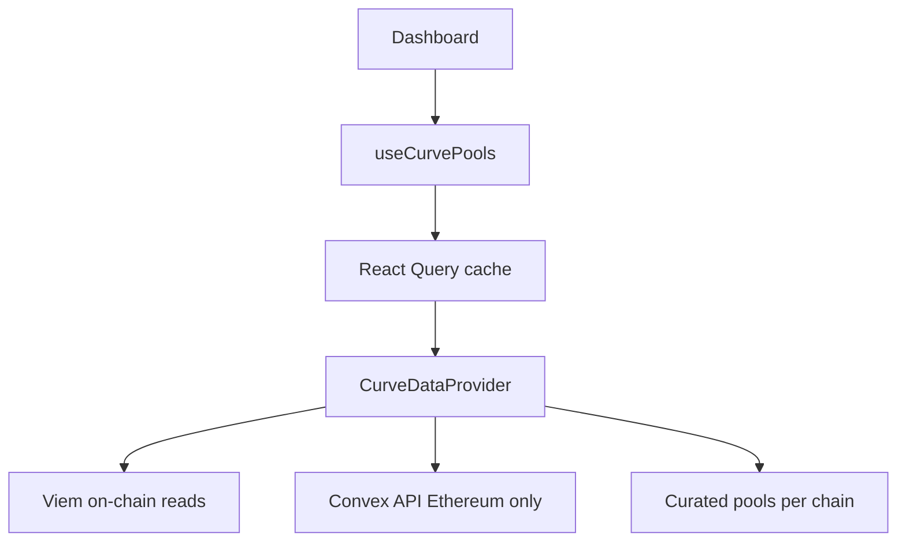

# Task 11 Plan — Curve and Convex Data Integration

Decision alignment
- Strategy: Mirror Aave with on-chain-first for Curve base APY, TVL, and peg metrics. Use Convex API only on Ethereum for boosted APY; on other chains, boostedAPY = baseAPY.
- Rationale: Consistency with Aave’s provider layer which is on-chain-first via viem clients [AaveV3DataProvider.initializeClients()](src/lib/providers/aave.ts:47) and per-asset reads [AaveV3DataProvider.fetchViaProtocolDataProvider()](src/lib/providers/aave.ts:585). This keeps decentralization and reliability, while still surfacing realistic Convex boosts where they exist.

Scope mapping to specs
- tasks.md 11.1 Create CurveDataProvider for stable pool data fetching
- tasks.md 11.2 Add base APY and boosted APY calculations
- tasks.md 11.3 Implement TVL and peg deviation monitoring
- tasks.md 11.4 Create boosted LP table with pool information
- tasks.md 11.5 Add red highlighting for peg deviation > 0.3%
- requirements.md: 2.5 boosted LP table, 1.4 dashboard card coverage

Core data contract
- Provider interface to implement: [CurveDataProvider](src/types/providers.ts:26)
- Query key to integrate: [queryKeys.curveData](src/types/index.ts:92)
- Output type: [CurvePoolData](src/types/domain.ts)

Architecture

Files to add
- Provider: [src/lib/providers/curve.ts]
- ABIs: [src/lib/abis/curve.ts]
- Curated pools registry: [src/lib/curve/pools.ts]
- React Query hook: [src/hooks/useCurvePools.ts]
- UI table: [src/components/BoostedLPTable.tsx]
- Optional top card: [src/components/CurveTopApyCard.tsx]
- Tests:
  - [src/lib/providers/__tests__/curve.provider.test.ts]
  - [src/hooks/__tests__/useCurvePools.test.tsx]
  - [src/components/__tests__/BoostedLPTable.render.test.tsx]
- Config: .env keys CURVE_CONVEX_API_BASE or CONVEX_API_BASE; document in [.env.example](.env.example)

On-chain calculation details

1) Base APY
- Metric: Compute from Curve pool virtual price growth over time.
- On-chain read: get_virtual_price from pool (1e18 scale).
- Derivation:
  - Maintain last observation vp0 at t0 and current vp1 at t1. Let r = vp1 / vp0 - 1 over dt = t1 - t0 seconds.
  - Annualize APR: apr = r * (31536000 / dt). Clamp to sane bounds [ -0.2, 0.5 ] during outliers.
  - For first observation lacking history, set baseAPY = 0 until second sample. Optionally smooth using EMA to reduce noise.
- Implementation:
  - Provider keeps an in-memory map lastVirtualPrice per poolAddress with timestamp, or computes delta via RQ cache layer by merging with previous query data.

2) TVL
- Reads:
  - totalSupply of LP token (generally 18 decimals).
  - get_virtual_price.
- Approximate USD TVL: tvlUSD ≈ totalSupply * virtual_price / 1e18, treating stables as 1 USD. Store as bigint in base units of 1e18 scaled USD notionally.

3) Peg deviation
- MVP approximation without external price oracles:
  - Read per-coin balances via balances(i) and normalize by token decimals to raw units.
  - For n-asset stable pool, compute share_i = normalized_balance_i / sum(normalized_balance_j).
  - Target equal-share baseline 1/n. Define pegDeviation = max_i |share_i - 1/n|.
  - Report as a decimal percentage; highlight if > 0.3%.
- Notes:
  - This captures imbalance as a proxy for peg stress. Future improvement: normalize with external USD prices via Chainlink or Curve oracles to refine the metric.

4) Pool discovery
- We will use a curated static registry of the most liquid stable pools per chain (USDC, USDT, DAI combinations). The registry will include:
  - chainId, poolAddress, lpTokenAddress, optional gaugeAddress, human name, assets, optional convexPoolId (Ethereum).
- File: [src/lib/curve/pools.ts] with typed entries and helpers.

Convex boosted APY

- Only on Ethereum:
  - Fetch Convex boosted APY per pool using a configurable REST endpoint CONVEX_API_BASE returning a mapping keyed by pool address or convexPoolId.
  - boostedAPY = max(baseAPY, convexBoostedAPY) or directly convex APY if it already includes base plus boost as published by Convex. We will implement a mapping function so that if the API provides multiple APYs, we choose the “apy” or “apyWeek” field as configured.
  - Fallback: if API fails or pool not found, boostedAPY = baseAPY.
- On non-Ethereum chains:
  - boostedAPY = baseAPY.

Provider design

- Class: CurveOnChainProvider implements [CurveDataProvider](src/types/providers.ts:26)
- Client setup mirrors Aave [AaveV3DataProvider.initializeClients()](src/lib/providers/aave.ts:47) using viem createPublicClient per supported chain with the same RPC selection strategy.
- Methods:
  - getPoolData(chain, poolAddress): reads get_virtual_price, totalSupply, balances, computes baseAPY, tvl, pegDeviation, merges Convex boosted APY if mainnet, returns [CurvePoolData](src/types/domain.ts).
  - getTopStablePools(chain): returns top N curated pools from registry with computed data.
  - getPoolsByAssets(chain, assets): filters registry by selected assets and returns computed data.
  - fetchData(chains, assets): batches per chain using multicall where practical for balances and totals; returns flattened CurvePoolData[].
- Caching strategy:
  - React Query hook will set staleTime 60–120s and refetchInterval aligned with UI autoRefresh.
  - Provider keeps ephemeral lastVirtualPrice per pool to compute delta between calls in-session. Across reloads, rely on RQ previousData for continuity.

React Query hook

- File: [src/hooks/useCurvePools.ts]
- API:
  - useCurvePools(params?: { chains?: SupportedChainId[]; enabled?: boolean; refetchInterval?: number|false })
  - Default chains from UI store selection [useUIStore](src/store/ui.ts:68)
  - Query key: [queryKeys.curveData](src/types/index.ts:92)
  - Sort results by boostedAPY desc by default; expose error/loading states.

UI integration

- Component: [src/components/BoostedLPTable.tsx]
  - Columns: Pool name, Chain, Base APY, Boosted APY, TVL, Peg deviation.
  - Formatting:
    - Percent with 2 decimals, TVL compact format.
    - Peg deviation highlighted red if > 0.3%.
  - Empty and error states.
- Dashboard changes: [Dashboard](src/components/Dashboard.tsx:16)
  - Render BoostedLPTable below Loop Monitor section.
- Optional card: [src/components/CurveTopApyCard.tsx] for Requirement 1.4
  - Displays top boosted APY among current chain selection.

Configuration

- .env and [.env.example](.env.example) additions:
  - CONVEX_API_BASE=https://api.convexfinance.com  // placeholder, to be confirmed during implementation
- Validation: use existing config validation helper if needed [validateConfig()](src/lib/validateConfig.ts).

Error handling

- Use [ProviderError](src/types/providers.ts:60) and [NetworkError](src/types/providers.ts:79) for provider-level failures.
- UI shows friendly messages and continues rendering other data. Circuit-breaker patterns can be added later if required.

Testing

- Provider unit tests: [src/lib/providers/__tests__/curve.provider.test.ts]
  - Mock viem readContract responses for get_virtual_price, totalSupply, balances.
  - Mock Convex API responses and failure cases.
  - Validate baseAPY annualization math and pegDeviation thresholds.
- Hook tests: [src/hooks/__tests__/useCurvePools.test.tsx]
  - Verify caching, sorting, enabled flags, and previousData behavior.
- Component tests: [src/components/__tests__/BoostedLPTable.render.test.tsx]
  - Renders, formats metrics, highlights pegDeviation > 0.3%.

Initial curated pool set for MVP

- Ethereum: 3pool legacy, 3pool new (if desired), commonly used USDC-DAI-USDT pools
- Arbitrum: 2pool or predominant stables pool
- Optimism: stable 2pool
- Polygon: Aave 3pool style stables
- Exact addresses will be filled during implementation in [src/lib/curve/pools.ts] with checksummed addresses.

Performance and limits

- Limit to 3–5 pools per chain initially to keep calls bounded.
- Use multicall where ABIs allow batching balances.
- Refetch defaults: 60s, adjustable by UI store. Hook respects autoRefresh from store if we mirror Aave patterns.

Acceptance criteria mapping

- Requirement 2.5: Boosted LP table includes name, base APY, boosted APY, TVL, peg deviation; red highlight if > 0.3%.
- Requirement 1.4: Optional top card for best Curve boosted APY on Dashboard.
- tasks.md 11.* bullets covered per sections above.

Milestones

- M1: ABIs and pools registry stub plus provider skeleton compiles.
- M2: On-chain base APY, TVL, pegDeviation computed for at least one pool per chain.
- M3: Convex boosted APY on Ethereum wired, fallback elsewhere.
- M4: Hook and BoostedLPTable integrated in Dashboard.
- M5: Tests passing and documentation updated.

References in repo
- Provider interface [CurveDataProvider](src/types/providers.ts:26)
- Query keys [queryKeys.curveData](src/types/index.ts:92)
- Dashboard root [Dashboard](src/components/Dashboard.tsx:16)
- Aave provider client pattern [AaveV3DataProvider.initializeClients()](src/lib/providers/aave.ts:47)