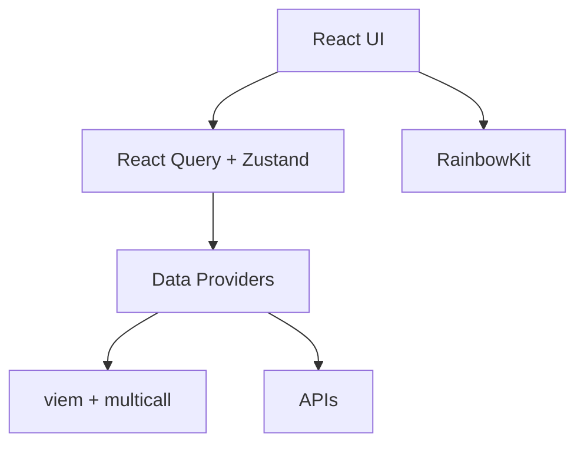
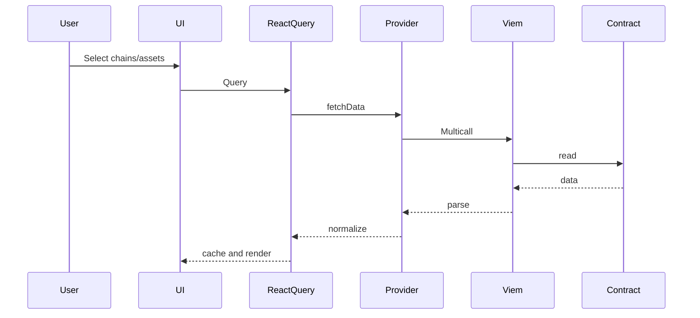

# Stablecoin Yield Monitor

Real-time dashboard for stablecoin yields, looping spreads, and risk across top chains and protocols.

Key protocols: Aave v3, Curve/Convex, MakerDAO DSR, Pendle. Focus assets: USDC, USDT, DAI, FRAX.

Specs: [requirements.md](.kiro/specs/stablecoin-yield-monitor/requirements.md) • [design.md](.kiro/specs/stablecoin-yield-monitor/design.md) • [tasks.md](.kiro/specs/stablecoin-yield-monitor/tasks.md)

Features
- Multi-chain support: Ethereum, Arbitrum One, Optimism, Polygon PoS
- Wallet connectivity via RainbowKit + wagmi
- On-chain reads via viem with multicall
- Typed data layer and providers
- Tailwind + shadcn/ui, dark mode
- React Query caching
- Config validation with non-blocking dev warnings

Architecture

High-level

Data flow

Getting started
- Requirements: Node 18+, npm
- Clone and install:
  - git clone <repo>
  - cd vs_front
  - npm install
- Create .env (see [.env.example](.env.example)):
  - VITE_ALCHEMY_API_KEY=your_key
  - VITE_WALLETCONNECT_PROJECT_ID=your_id
- Run:
  - npm run dev
- Build:
  - npm run build
- Test:
  - npm test

Configuration and chains
- Chains config: [src/lib/chains.ts](src/lib/chains.ts:11)
- Multicall: [MULTICALL_CONFIG](src/lib/chains.ts:100)
- Wagmi config: [wagmiConfig](src/lib/wagmi.ts:19)
- Providers shell: [Providers()](src/providers/index.tsx:27)
- Config validation: [validateConfig()](src/lib/validateConfig.ts:17) and banner [ConfigBanner()](src/components/ConfigBanner.tsx:5)

Data providers and types
- Aave v3: [AaveV3DataProvider()](src/lib/providers/aave.ts:28)
  - fetch: [fetchData()](src/lib/providers/aave.ts:64)
  - reserve: [getReserveData()](src/lib/providers/aave.ts:86)
  - E-Mode: [getEModeCategories()](src/lib/providers/aave.ts:153)
  - Reserves list: [getReservesList()](src/lib/providers/aave.ts:168)
- ABIs: [UiPoolDataProviderV3](src/lib/abis/aave.ts:4) • [AaveProtocolDataProvider](src/lib/abis/aave.ts:345)
- Ray helpers: [rayToDecimal()](src/lib/abis/aave.ts:488)
- Domain types: [StablecoinYield](src/types/domain.ts:12), [StablecoinAsset](src/types/chains.ts:2), [Protocol](src/types/chains.ts:5)

UI shell
- App: [App()](src/App.tsx:6)
- Entry: [src/main.tsx](src/main.tsx)
- Wallet test: [src/components/WalletTest.tsx](src/components/WalletTest.tsx)

Scripts
- npm run dev: start dev server
- npm run build: type-check and build
- npm run preview: preview build
- npm run lint / lint:fix
- npm run format / format:check
- npm test / test:watch

Current implementation status
- Project setup and tooling: completed
- Multi-chain infra and wallet connectivity: completed
- Core TypeScript types and provider interfaces: completed
- State management and React Query setup: completed
- Aave v3 data provider: implemented with on-chain reads and APY/utilization/caps calculations; not yet wired to UI
- Multicall utilities: implemented
- Config validation and dev banner: implemented
- Basic UI shell: present ([App()](src/App.tsx:6), [Providers()](src/providers/index.tsx:27))
- Tests: initial unit tests present ([src/lib/__tests__/addresses.test.ts](src/lib/__tests__/addresses.test.ts), [src/types/__tests__/types.test.ts](src/types/__tests__/types.test.ts))

What comes next
- Wire Aave provider data to a Dashboard with chain and asset filters and yield cards
- Implement loop calculation functions and risk metrics (LTV, health factor, negative spread detection)
- Build Loop Monitor table with health warnings and caps utilization
- Create Loop Calculator page with real-time updates and leverage controls
- Integrate Curve/Convex, DSR, and optional Pendle providers and UI
- Alerts system with local notification badges and rule persistence
- Reserve Details page with rate history sparklines
- Error boundaries, retries, and circuit breaker patterns
- Responsive design polish, dark mode across components
- Comprehensive tests and performance tuning

Tech stack
- React + TypeScript + Vite
- viem + wagmi + RainbowKit
- Tailwind CSS + shadcn/ui
- React Query

Notes
- In development, config issues appear as warnings via [ConfigBanner()](src/components/ConfigBanner.tsx:5). In production, [validateConfig()](src/lib/validateConfig.ts:17) fails fast on invalid setup.
